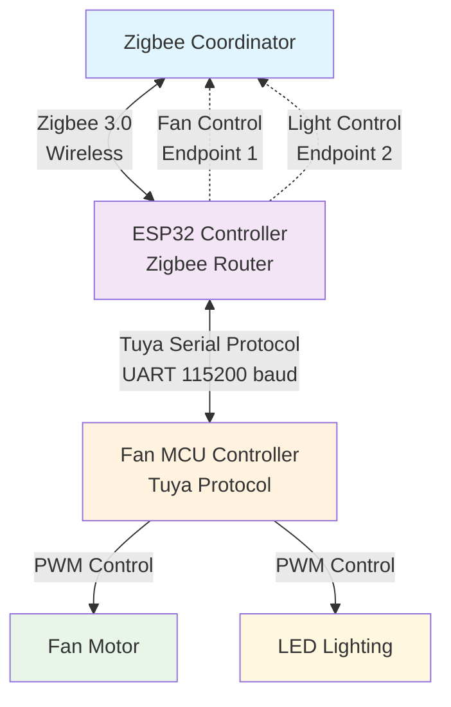

# Skyfan Zigbee Controller

A Zigbee 3.0 controller for Ventair Skyfan ceiling fans with integrated lighting, using ESP32 and Tuya MCU communication.

## Overview

This project implements a Zigbee interface for Ventair Skyfan ceiling fans that use Tuya MCU controllers. It provides bidirectional communication between the Zigbee network and the fan's MCU, enabling control and status reporting for both fan and integrated lighting functions.

## Features

### Fan Control
- **Power**: On/Off control
- **Speed**: 6 levels (0-5) mapped to Zigbee fan modes (Off/Low/Medium/High)
- **Mode**: Normal, Eco, Sleep (MCU-only, not exposed to Zigbee)
- **Direction**: Forward/Reverse (custom Zigbee attribute)

### Light Control  
- **Power**: On/Off control
- **Brightness**: 6 levels (0-5) mapped to Zigbee brightness (0-254)
- **Colour Temperature**: 3 settings (Warm 3000K / Natural 4200K / Cool 6500K)

### Zigbee Integration
- **Protocol**: Zigbee 3.0 Router mode
- **Endpoints**: Separate endpoints for fan (EP1) and light (EP2)
- **Bidirectional**: Status updates flow both directions (Zigbee ↔ MCU)
- **Standards Compliant**: Uses standard Zigbee Fan Control and Colour Dimmable Light clusters. It does use a manufacturer extension for Zigbee to support fan direction though (standard Zigbee fan profile is pretty limited).

## Hardware Requirements

- **ESP32-C6** or compatible ESP32 with Zigbee support
- **Ventair Skyfan** with Tuya MCU controller
- **Serial Connection**: Hardware UART between ESP32 and MCU (115200 baud)

## Architecture



## Project Structure

```
skyfan-zigbee/
├── src/
│   └── skyfan-zigbee/
│       ├── skyfan-zigbee.ino      # Main Arduino sketch with Zigbee endpoints and callbacks
│       ├── SkyfanConfig.h         # Centralized configuration constants and utility functions
│       ├── TuyaProtocol.h         # Tuya serial protocol header with constants and class definitions
│       ├── TuyaProtocol.cpp       # Tuya serial protocol implementation
│       └── SkyfanZigbee.h         # Extended Zigbee classes and custom attributes
├── electronics/
│   ├── gerber/                    # PCB manufacturing files (Gerber, drill, silkscreen)
│   └── README.md                  # Electronics design documentation
├── README.md                      # Project documentation and setup instructions
└── LICENCE.md                     # GNU General Public License v3.0 terms and conditions
```

## Protocol Details

### Tuya Serial Protocol
- **Frame Format**: `0x55AA + Version + Command + Length + Data + Checksum`
- **Baud Rate**: 115200
- **Data Points**: Boolean, Value, and Enum types for different controls

### Data Point Mapping
| Function | DPID | Type | Range | Zigbee Mapping |
|----------|------|------|--------|----------------|
| Fan Switch | 1 | Boolean | On/Off | Fan Mode (On/Off) |
| Fan Speed | 3 | Value | 0-5 | Fan Mode (Off/Low/Med/High) |
| Fan Mode | 2 | Enum | 0-2 | MCU only |
| Fan Direction | 8 | Enum | 0-1 | Custom attribute |
| Light Switch | 15 | Boolean | On/Off | Light State |
| Light Dimmer | 16 | Value | 0-5 | Light Level (0-254) |
| Light Colour Temp | 19 | Enum | 0-2 | Colour Temperature (mired) |

## Installation

1. **Configure Arduino IDE**:
   - Install ESP32 board package by Expressif (v3.3.5 or later)
   - Select your ESP32C6 board e.g. "XAIO_ESP32C6" or "Adafruit Feather ESP32-C6". If using a board other than the XAIO one, double-check the pinouts in this sketch
   - Set "Zigbee Mode" to "Zigbee ZCZR (coordinator/router)"

2. **Upload Firmware**:
   ```bash
   # Open src/skyfan-zigbee/skyfan-zigbee.ino in Arduino IDE
   # Verify and upload to ESP32-C6
   ```

3. **Hardware Connections**:
   - Connect ESP32 UART to MCU UART (TX↔RX, RX↔TX)
   - Common ground connection
   - Power ESP32 from appropriate source

## Usage

### Initial Setup
1. Power on the device
2. Device enters Zigbee joining mode automatically
3. Use Zigbee coordinator to permit joining and discover device
4. Two endpoints will be discovered: Fan Control and Light Control

### Factory Reset
- Hold BOOT button for 3+ seconds to factory reset Zigbee settings

### Status Monitoring
- Zigbee status changes are sent to MCU via network status commands
- MCU status changes are reported back to Zigbee coordinator
- Both fan and light controls support bidirectional updates

## Technical Implementation

### Extended Zigbee Classes
The project extends the standard ESP32 Zigbee library classes to add missing functionality:

```cpp
class SkyfanZigbeeFanControl : public ZigbeeFanControl {
  // Adds public setter methods for bidirectional status updates
  bool setFanMode(ZigbeeFanMode mode);
  bool setFanState(bool on);
  bool setFanSpeedMode(uint8_t speed);
};
```

### Bidirectional Communication
- **Zigbee → MCU**: Zigbee commands trigger Tuya data point updates
- **MCU → Zigbee**: MCU status reports update Zigbee cluster attributes
- **Network Sync**: Zigbee connection status communicated to MCU

## Configuration

### Zigbee Settings
- **Device ID**: Heating/Cooling Unit with Fan Control and Colour Dimmable Light
- **Manufacturer**: "Ventair"
- **Model**: "Skyfan" / "Skyfan Light"
- **Profile**: Home Automation (HA 1.2)

### Serial Protocol
- **Heartbeat**: 10-second intervals
- **Timeout**: 1-second response timeout
- **Buffer Size**: 256 bytes for frame processing

## Troubleshooting

### Common Issues
1. **No Zigbee Connection**: Check coordinator is in permit-join mode
2. **No MCU Response**: Verify UART connections and baud rate
3. **Partial Functionality**: Check data point mappings in TuyaProtocol.h

### Debug Mode
All the debug statements are currently commented out because the expressif ESP32 board library doesn't have Software Serial included, and installing it from here (https://github.com/plerup/espsoftwareserial) as the seeed wiki suggests is not as simple as it should be. Espsoftwareserial is dependent upon other libraries not included with the expressif board libraries, and I haven't bothered to track them down yet.

To see debugging once espsoftwareserial is sorted, uncomment debugSerial statements in code for debugging:
```cpp
// Uncomment SoftwareSerial includes and setup
// debugSerial.println("Debug message here");
```

## License

Licensed under the GNU Lesser General Public License v3.0 (LGPL-3.0).

## Author

**Rhys Frederick** - Front Left Speaker  
Copyright (c) 2025

## References

- [ESP32 Zigbee SDK Documentation](https://docs.espressif.com/projects/esp-idf/en/latest/esp32/api-reference/zigbee/index.html)
- [Tuya MCU Serial Protocol](https://developer.tuya.com/en/docs/iot/tuya-cloud-universal-serial-port-access-protocol?id=K9hhi0xxtn9cb)
- [Zigbee Cluster Library Specification](https://zigbeealliance.org/solution/zigbee/)
- [Skyfan DC Project](https://github.com/jeggleston1981/skyfandc) - Related DC motor version implementation
