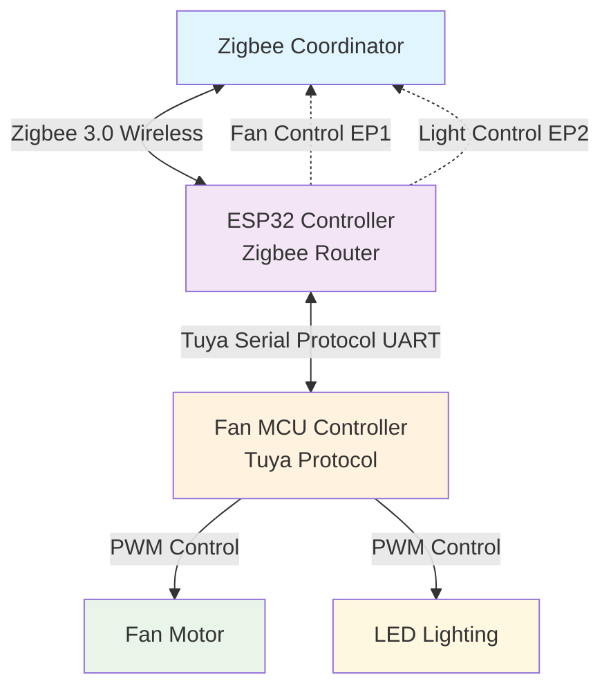

# Skyfan Zigbee Controller

A Zigbee 3.0 controller for Ventair Skyfan ceiling fans with integrated lighting, using ESP32 and Tuya MCU communication. Note that Ventair is not associated with this project.

## Overview

This project implements a Zigbee interface for Ventair Skyfan ceiling fans that use Tuya MCU controllers. It provides bidirectional communication between the Zigbee network and the fan's MCU, enabling control and status reporting for both fan and integrated lighting functions.

Note, this is very much work in progress. HW integration is not yet tested, waiting on PCB to do so. Should you try this? Probably not just yet.

## Features

### Build Configuration
- **Dual Model Support**: Configurable build for fan-only or fan+light models
- **Conditional Compilation**: `WITH_LIGHT` define controls light functionality inclusion
- **Model Variants**: "Ventair Skyfan ZB Adaptor" (fan-only) or "Ventair Skyfan/Light ZB Adaptor" (fan+light)

### Fan Control
- **Power**: On/Off control
- **Speed**: 6 levels (0-5) mapped to Zigbee fan modes (Off/Low/Medium/High)
- **Mode**: Normal, Eco, Sleep (MCU-only, not exposed to Zigbee)
- **Direction**: Forward/Reverse (custom Zigbee attribute)

### Light Control (WITH_LIGHT enabled)
- **Power**: On/Off control
- **Brightness**: 6 levels (0-5) mapped to Zigbee brightness (0-254)
- **Colour Temperature**: 3 settings (Warm 3000K / Natural 4200K / Cool 6500K)

### Zigbee Integration
- **Protocol**: Zigbee 3.0 Router mode
- **Endpoints**: Fan control (EP1), optional light control (EP2) when WITH_LIGHT enabled
- **Bidirectional**: Status updates flow both directions (Zigbee ↔ MCU)
- **Standards Compliant**: Uses standard Zigbee Fan Control and Colour Dimmable Light clusters with manufacturer extension for fan direction

### Visual Feedback
- **Network Status LED**: Visual indication of Zigbee connection state
- **Command Feedback**: LED flashes for 50ms on Zigbee commands with 15ms off period for overlapping commands
- **Factory Reset**: Hold BOOT button for 3+ seconds to reset Zigbee settings

### OTA Updates
- **Zigbee OTA**: Firmware updates over Zigbee via Zigbee2MQTT
- **Automatic Checks**: Device queries for updates hourly after joining network
- **Safe Updates**: Factory reset is blocked during OTA to prevent corruption

## Hardware Requirements

- **ESP32-C6** or compatible ESP32 with Zigbee support
- **Ventair Skyfan** with Tuya MCU controller
- **Serial Connection**: Hardware UART between ESP32 and MCU (115200 baud)

## Architecture


```mermaid
graph TD
    ZC["Zigbee Coordinator"]
    ESP["ESP32 Controller<br/>Zigbee Router"]
    MCU["Fan MCU Controller<br/>Tuya Protocol"]
    FAN["Fan Motor"]
    LIGHT["LED Lighting"]
    
    ZC <-->|"Zigbee 3.0 Wireless"| ESP
    ESP <-->|"Tuya Serial Protocol UART"| MCU
    MCU -->|"PWM Control"| FAN
    MCU -->|"PWM Control"| LIGHT
    
    ESP -.->|"Fan Control EP1"| ZC
    ESP -.->|"Light Control EP2"| ZC
    
    classDef coordinator fill:#e1f5fe
    classDef controller fill:#f3e5f5
    classDef mcu fill:#fff3e0
    classDef motor fill:#e8f5e8
    classDef lighting fill:#fff8e1
    
    class ZC coordinator
    class ESP controller
    class MCU mcu
    class FAN motor
    class LIGHT lighting
```

## Project Structure

```
skyfan-zigbee/
├── src/
│   └── skyfan-zigbee/
│       ├── skyfan-zigbee.ino      # Main Arduino sketch with Zigbee endpoints and callbacks
│       ├── SkyfanConfig.h         # Configuration constants, enums, and utility functions
│       ├── SkyfanZigbee.h         # Extended Zigbee fan control class declarations
│       ├── SkyfanZigbee.cpp       # Extended Zigbee fan control implementation
│       ├── TuyaProtocol.h         # Tuya serial protocol header with constants and class definitions
│       ├── TuyaProtocol.cpp       # Tuya serial protocol implementation
│       ├── LedIndicator.h         # LED status indicator class declarations
│       ├── LedIndicator.cpp       # LED status indicator implementation
│       ├── ButtonHandler.h        # Non-blocking button handler class declarations
│       └── ButtonHandler.cpp      # Non-blocking button handler implementation
├── zigbee2mqtt/
│   ├── skyfanConverter.mjs        # Zigbee2MQTT converter for fan+light models
│   └── skyfanFanOnlyConverter.mjs # Zigbee2MQTT converter for fan-only models
├── electronics/
│   ├── gerber/                    # PCB manufacturing files (Gerber, drill, silkscreen)
│   └── README.md                  # Electronics design documentation
├── README.md                      # Project documentation and setup instructions
└── LICENCE.md                     # GNU General Public License v3.0 terms and conditions
```

## Protocol Details

### Tuya Serial Protocol
- **Frame Format**: `0x55AA + Version + Command + Length + Data + Checksum`
- **Baud Rate**: 115200
- **Data Points**: Boolean, Value, and Enum types for different controls

### Data Point Mapping
| Function | DPID | Type | Range | Zigbee Mapping |
|----------|------|------|--------|----------------|
| Fan Switch | 1 | Boolean | On/Off | Fan Mode (On/Off) |
| Fan Speed | 3 | Value | 0-5 | Fan Mode (Off/Low/Med/High) |
| Fan Mode | 2 | Enum | 0-2 | MCU only |
| Fan Direction | 8 | Enum | 0-1 | Custom attribute |
| Light Switch | 15 | Boolean | On/Off | Light State |
| Light Dimmer | 16 | Value | 0-5 | Light Level (0-254) |
| Light Colour Temp | 19 | Enum | 0-2 | Colour Temperature (mired) |

## Installation

1. **Configure Build Type**:
   - Open `src/skyfan-zigbee/SkyfanConfig.h`
   - For fan+light models: Keep `#define WITH_LIGHT` uncommented
   - For fan-only models: Comment out `#define WITH_LIGHT`

2. **Configure Arduino IDE**:
   - Install ESP32 board package by Expressif (v3.3.5 or later)
   - Select your ESP32C6 board e.g. "XAIO_ESP32C6" or "Adafruit Feather ESP32-C6". If using a board other than the XAIO one, double-check the pinouts in this sketch
   - Set "Partition Scheme" to "Zigbee ZCZR 4MB with spiffs"
   - Set "Zigbee Mode" to "Zigbee ZCZR (coordinator/router)"

3. **Upload Firmware**:
   ```bash
   # Open src/skyfan-zigbee/skyfan-zigbee.ino in Arduino IDE
   # Verify and upload to ESP32-C6
   ```

4. **Configure Zigbee2MQTT**:
   - For fan+light models: Use `zigbee2mqtt/skyfanConverter.mjs`
   - For fan-only models: Use `zigbee2mqtt/skyfanFanOnlyConverter.mjs`
   - Copy the appropriate converter to your Zigbee2MQTT external converters directory

5. **Hardware Connections**:
   - Connect ESP32 UART to MCU UART (TX↔RX, RX↔TX)
   - Common ground connection
   - Power ESP32 from appropriate source

## Usage

### Initial Setup
1. Power on the device
2. Device enters Zigbee joining mode automatically
3. Use Zigbee coordinator to permit joining and discover device
4. Endpoints discovered depend on build configuration:
   - Fan+Light: Two endpoints (Fan Control and Light Control)
   - Fan-Only: Single endpoint (Fan Control only)

### LED Status Indication
The built-in LED provides visual feedback about the device's network status and command activity:

#### Network Status
- **Rapid Flash** (5Hz): Factory new - device has never joined a network and needs pairing
- **Solid On**: Initialising - device is starting up or attempting to connect to network
- **Off**: Connected - device is successfully connected to Zigbee coordinator

#### Command Feedback
- **50ms Flash**: LED flashes briefly when Zigbee commands are received and processed

## Technical Implementation

### Extended Zigbee Classes
The project extends the standard ESP32 Zigbee library classes to add some missing functionality for bi-drectional operation:

```cpp
class SkyfanZigbeeFanControl : public ZigbeeFanControl {
  // Adds public setter methods for bidirectional status updates
  bool setFanMode(ZigbeeFanMode mode);
  bool setFanState(bool on);
  bool setFanSpeed(uint8_t speed);
};
```

### Bidirectional Communication
- **Zigbee → MCU**: Zigbee commands trigger Tuya data point updates
- **MCU → Zigbee**: MCU status reports update Zigbee cluster attributes

## Configuration

### Build Configuration
Before compiling, configure the target device type in `SkyfanConfig.h`:

```cpp
// === Feature Configuration ===
#define WITH_LIGHT  // Comment out to disable light functionality
```

**Fan+Light Model** (WITH_LIGHT defined):
- Model: "Ventair Skyfan/Light ZB Adaptor"  
- Includes light endpoint and controls
- Use `skyfanConverter.mjs` for Zigbee2MQTT

**Fan-Only Model** (WITH_LIGHT undefined):
- Model: "Ventair Skyfan ZB Adaptor"
- Fan controls only, smaller firmware size
- Use `skyfanFanOnlyConverter.mjs` for Zigbee2MQTT

### Serial Protocol
- **Heartbeat**: 10-second intervals
- **Timeout**: 1-second response timeout
- **Buffer Size**: 256 bytes for frame processing

## OTA Updates

The device supports over-the-air firmware updates via Zigbee. Updates are delivered through Zigbee2MQTT using the standard Zigbee OTA cluster.

### Zigbee2MQTT Configuration

To enable OTA updates, add the following to your Zigbee2MQTT `configuration.yaml`:

```yaml
ota:
  zigbee_ota_override_index_location: https://raw.githubusercontent.com/rhysfred/skyfan-zigbee/main/zigbee2mqtt/ota-index.json
```

### Update Process

1. When a new firmware version is released, update the `zigbee2mqtt/ota-index.json` with the new release information
2. Zigbee2MQTT will detect the available update when it checks the index
3. Trigger the update through the Zigbee2MQTT frontend or API
4. The device LED will blink during the update process
5. Device reboots automatically after successful update

### Version Numbering

OTA versions use a 32-bit format (0xMMmmppBB):
- MM: Major version (0-255)
- mm: Minor version (0-255)
- pp: Patch version (0-255)
- BB: Build number (alpha=1-15, beta=17-31, rc=33-47, release=255)

Example: v0.0.4-alpha.1 → 0x00000401 (decimal: 1025)

### Adding New Releases to OTA Index

When creating a new release, add an entry to `zigbee2mqtt/ota-index.json`:

```json
{
  "url": "https://github.com/rhysfred/skyfan-zigbee/releases/download/v0.0.5/skyfan-zigbee.ota",
  "manufacturerCode": 6168,
  "imageType": 1,
  "fileVersion": 1535,
  "modelId": "Ventair Skyfan/Light ZB Adaptor"
}
```

## Troubleshooting

### Debug Mode
Debug output is available via the USB-C connector using the built-in Serial interface. The debug output provides:

- Startup and initialization messages
- Zigbee connection status and progress
- Fan and light control commands
- Status updates from the MCU
- Error messages and validation failures

**Enhanced Protocol Debug**: For detailed MCU and Zigbee protocol traces, uncomment `// #define __DEBUG__` in `SkyfanConfig.h` before compilation.

Debug output runs at 9600 baud and can be viewed using the Arduino IDE Serial Monitor or any terminal program. Note yet to test that the usb-c port can be used at the same time that the adaptor is plugged into the fan.

## License

Licensed under the GNU Lesser General Public License v3.0 (LGPL-3.0).

## Author

**Rhys Frederick** - Front Left Speaker  
Copyright (c) 2025

## References

- [ESP32 Zigbee SDK Documentation](https://docs.espressif.com/projects/esp-idf/en/latest/esp32/api-reference/zigbee/index.html)
- [Tuya MCU Serial Protocol](https://developer.tuya.com/en/docs/iot/tuya-cloud-universal-serial-port-access-protocol?id=K9hhi0xxtn9cb)
- [Zigbee Cluster Library Specification](https://zigbeealliance.org/solution/zigbee/)
- [Skyfan DC Project](https://github.com/jeggleston1981/skyfandc) - Related DC motor version implementation
