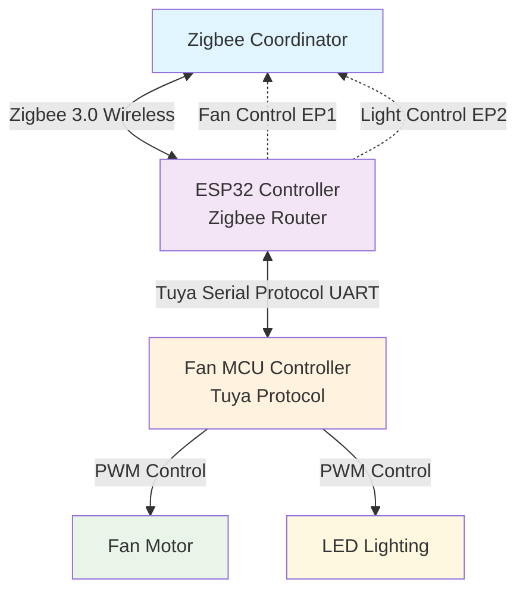

# Skyfan Zigbee Controller

A Zigbee 3.0 controller for Ventair Skyfan ceiling fans with integrated lighting, using ESP32 and Tuya MCU communication. Note that Ventair is not associated with this project.

## Overview

This project implements a Zigbee interface for Ventair Skyfan ceiling fans that use Tuya MCU controllers. It provides bidirectional communication between the Zigbee network and the fan's MCU, enabling control and status reporting for both fan and integrated lighting functions.

**Status**: Version 1.0.0. Tested with a Skyfan DC with Light.

## Features

### Automatic Model Detection
- **Runtime Detection**: Single universal firmware detects fan-only or fan+light models from MCU product ID
- **Model Variants**: "Ventair Skyfan ZB Adaptor" (fan-only) or "Ventair Skyfan/Light ZB Adaptor" (fan+light)
- **Safe Default**: Defaults to fan+light if product ID is unavailable

### Fan Control
- **Power**: On/Off control
- **Speed**: 6 levels (0-5) mapped to Zigbee fan modes (Off/Low/Medium/High)
- **Mode**: Normal, Eco, Sleep (MCU-only, not exposed to Zigbee)
- **Direction**: Forward/Reverse (custom Zigbee attribute)

### Light Control (fan+light models)
- **Power**: On/Off control
- **Brightness**: 6 levels (0-5) mapped to Zigbee brightness (0-254)
- **Colour Temperature**: 3 settings (Warm 3000K / Natural 4200K / Cool 6500K)

### Zigbee Integration
- **Protocol**: Zigbee 3.0 Router mode
- **Endpoints**: Fan control (EP1), optional light control (EP2) on fan+light models
- **Bidirectional**: Status updates flow both directions (Zigbee ↔ MCU)
- **Standards Compliant**: Uses standard Zigbee Fan Control and Colour Dimmable Light clusters with manufacturer extension for fan direction

### Visual Feedback
- **Network Status LED**: Visual indication of Zigbee connection state
- **Command Feedback**: LED flashes for 50ms on Zigbee commands with 15ms off period for overlapping commands
- **Factory Reset**: Hold BOOT button for 3+ seconds to reset Zigbee settings

### OTA Updates
- **Zigbee OTA**: Firmware updates over Zigbee via Zigbee2MQTT
- **Automatic Checks**: Device queries for updates hourly after joining network
- **Safe Updates**: Factory reset is blocked during OTA to prevent corruption

## Hardware Requirements

- **ESP32-C6** or compatible ESP32 with Zigbee support
- **Ventair Skyfan** with Tuya MCU controller
- **Serial Connection**: Hardware UART between ESP32 and MCU (auto-negotiates 9600 or 115200 baud)

## Architecture


```mermaid
graph TD
    ZC["Zigbee Coordinator"]
    ESP["ESP32 Controller<br/>Zigbee Router"]
    MCU["Fan MCU Controller<br/>Tuya Protocol"]
    FAN["Fan Motor"]
    LIGHT["LED Lighting"]
    
    ZC <-->|"Zigbee 3.0 Wireless"| ESP
    ESP <-->|"Tuya Serial Protocol UART"| MCU
    MCU -->|"PWM Control"| FAN
    MCU -->|"PWM Control"| LIGHT
    
    ESP -.->|"Fan Control EP1"| ZC
    ESP -.->|"Light Control EP2"| ZC
    
    classDef coordinator fill:#e1f5fe
    classDef controller fill:#f3e5f5
    classDef mcu fill:#fff3e0
    classDef motor fill:#e8f5e8
    classDef lighting fill:#fff8e1
    
    class ZC coordinator
    class ESP controller
    class MCU mcu
    class FAN motor
    class LIGHT lighting
```

## Project Structure

```
skyfan-zigbee/
├── .github/
│   └── workflows/
│       └── build-release.yml      # CI/CD workflow for automated builds and releases
├── src/
│   └── skyfan-zigbee/
│       ├── skyfan-zigbee.ino      # Main Arduino sketch with Zigbee endpoints and callbacks
│       ├── SkyfanConfig.h         # Configuration constants, enums, and utility functions
│       ├── SkyfanZigbee.h         # Extended Zigbee fan control class declarations
│       ├── SkyfanZigbee.cpp       # Extended Zigbee fan control implementation
│       ├── SkyfanZigbeeLight.h    # Extended Zigbee light control class declarations
│       ├── SkyfanZigbeeLight.cpp  # Extended Zigbee light control implementation
│       ├── TuyaProtocol.h         # Tuya serial protocol header with constants and class definitions
│       ├── TuyaProtocol.cpp       # Tuya serial protocol implementation
│       ├── LedIndicator.h         # LED status indicator class declarations
│       ├── LedIndicator.cpp       # LED status indicator implementation
│       ├── ButtonHandler.h        # Non-blocking button handler class declarations
│       ├── ButtonHandler.cpp      # Non-blocking button handler implementation
│       ├── PersistedProperties.h  # NVS-backed persistent property storage declarations
│       ├── PersistedProperties.cpp # NVS-backed persistent property storage implementation
│       └── Logger.h               # Centralised logging utilities
├── zigbee2mqtt/
│   ├── skyfanConverter.mjs        # Zigbee2MQTT converter for both fan+light and fan-only models
│   └── ota-index.json             # OTA firmware index for Zigbee2MQTT (auto-updated on release)
├── electronics/
│   ├── gerber/                    # PCB manufacturing files (Gerber, drill, silkscreen)
│   ├── SkyFanController.brd       # Eagle board layout
│   ├── SkyFanController.sch       # Eagle schematic
│   ├── SkyfanController.f3z       # Fusion 360 design archive
│   └── README.md                  # Electronics design documentation
├── README.md                      # Project documentation and setup instructions
└── LICENCE.md                     # GNU General Public License v3.0 terms and conditions
```

## Protocol Details

### Tuya Serial Protocol
- **Frame Format**: `0x55AA + Version + Command + Length + Data + Checksum`
- **Baud Rate**: Auto-negotiated (tries 9600 first per Tuya spec, falls back to 115200)
- **Checksum Validation**: All incoming packets validated before processing
- **Data Points**: Boolean, Value, and Enum types for different controls

### Data Point Mapping
| Function | DPID | Type | Range | Zigbee Mapping |
|----------|------|------|--------|----------------|
| Fan Switch | 1 | Boolean | On/Off | Fan Mode (On/Off) |
| Fan Speed | 3 | Value | 0-5 | Fan Mode (Off/Low/Med/High) |
| Fan Mode | 2 | Enum | 0-2 | MCU only |
| Fan Direction | 8 | Enum | 0-1 | Custom attribute |
| Light Switch | 15 | Boolean | On/Off | Light State |
| Light Dimmer | 16 | Value | 0-5 | Light Level (0-254) |
| Light Colour Temp | 19 | Enum | 0-2 | Colour Temperature (mired) |

## Installation

1. **Configure Arduino IDE**:
   - Install ESP32 board package by Expressif (v3.3.5 or later)
   - Select your ESP32C6 board e.g. "XIAO_ESP32C6" or "Adafruit Feather ESP32-C6". If using a board other than the XIAO one, double-check the pinouts in this sketch
   - Set "Partition Scheme" to "Zigbee ZCZR 4MB with spiffs"
   - Set "Zigbee Mode" to "Zigbee ZCZR (coordinator/router)"

2. **Upload Firmware**:
   ```bash
   # Open src/skyfan-zigbee/skyfan-zigbee.ino in Arduino IDE
   # Verify and upload to ESP32-C6
   ```

3. **Configure Zigbee2MQTT**:
   - Copy `zigbee2mqtt/skyfanConverter.mjs` to your Zigbee2MQTT external converters directory
   - This single converter handles both fan+light and fan-only models automatically

4. **Hardware Connections**:
   - Connect ESP32 UART to MCU UART (TX↔RX, RX↔TX)
   - Common ground connection
   - Power ESP32 from appropriate source

## Usage

### Initial Setup
1. Power on the device
2. Device enters Zigbee joining mode automatically
3. Use Zigbee coordinator to permit joining and discover device
4. Endpoints discovered depend on detected model:
   - Fan+Light: Two endpoints (Fan Control and Light Control)
   - Fan-Only: Single endpoint (Fan Control only)

### LED Status Indication
The built-in LED provides visual feedback about the device's network status and command activity:

#### Network Status
- **Rapid Flash** (5Hz): Factory new - device has never joined a network and needs pairing
- **Solid On**: Initialising - device is starting up or attempting to connect to network
- **Off**: Connected - device is successfully connected to Zigbee coordinator

#### Command Feedback
- **50ms Flash**: LED flashes briefly when Zigbee commands are received and processed

## Technical Implementation

### Extended Zigbee Classes
The project extends the standard ESP32 Zigbee library classes to add functionality for bidirectional operation and attribute reporting:

```cpp
class SkyfanZigbeeFanControl : public ZigbeeEP {
  // Replicates ZigbeeFanControl with added features:
  // - Public setter methods for bidirectional status updates
  // - Raw APS reporting (bypasses attribute access flag limitations)
  // - Custom manufacturer cluster for fan direction
  // - Confirmed state tracking with rollback on MCU failure
  // - MCU status update handling (validates, updates attributes, reports)
  bool setFanMode(ZigbeeFanMode mode);
  bool setFanState(bool on);
  bool setFanSpeed(uint8_t speed);
  bool reportFanMode();         // Uses raw APS for reliable reporting
  bool reportFanDirection();    // Uses raw APS for reliable reporting
  void reportAllAttributes();   // Reports all attributes to coordinator
  void handleStatusUpdate();    // Processes MCU status updates for fan DPIDs
  void rollback();              // Reverts to last MCU-confirmed state
};
```

### Bidirectional Communication
- **Zigbee → MCU**: Zigbee commands trigger Tuya data point updates
- **MCU → Zigbee**: MCU status reports update Zigbee cluster attributes

## Configuration

### Model Detection
The firmware automatically detects the connected fan model at runtime using the MCU's product ID. No build configuration is required.

- **Known light model** (`pktxz1vynowmavuc`): Registers fan + light endpoints, model name "Ventair Skyfan/Light ZB Adaptor"
- **Other product IDs**: Registers fan endpoint only, model name "Ventair Skyfan ZB Adaptor"
- **No product ID available**: Defaults to fan+light for safety

The detected product ID is cached in NVS and persists across reboots. Use the serial `p` command to view the stored product ID.

### Serial Protocol
- **Heartbeat**: 10-second intervals
- **Status Timeout**: 1.5 seconds for MCU status confirmation
- **Buffer Size**: 256 bytes for frame processing

## OTA Updates

The device supports over-the-air firmware updates via Zigbee. Updates are delivered through Zigbee2MQTT using the standard Zigbee OTA cluster.

### Zigbee2MQTT Configuration

To enable OTA updates, add the following to your Zigbee2MQTT `configuration.yaml`:

```yaml
ota:
  zigbee_ota_override_index_location: https://raw.githubusercontent.com/rhysfred/skyfan-zigbee/main/zigbee2mqtt/ota-index.json
```

### Update Process

1. New firmware releases automatically update `zigbee2mqtt/ota-index.json` via CI/CD
2. Zigbee2MQTT will detect the available update when it checks the index
3. Trigger the update through the Zigbee2MQTT frontend or API
4. The device LED will blink during the update process
5. Device reboots automatically after successful update

### Version Numbering

OTA versions use a 32-bit format: `0xRRRRRDDD`
- Upper 20 bits (`RRRRR`): Tagged releases (always ≥ 0x00001000)
- Lower 12 bits (`DDD`): Dev builds (1-4095)

**Release encoding** (5 bits each in upper 20 bits):
- Major: bits 27-31 (0-31)
- Minor: bits 22-26 (0-31)
- Patch: bits 17-21 (0-31)
- Prerelease: bits 12-16 (alpha=1-10, beta=12-21, rc=23-30, stable=31)

**Examples**:
| Version | Hex | Decimal |
|---------|-----|---------|
| dev build 50 | 0x00000032 | 50 |
| v0.0.4-alpha.1 | 0x00081000 | 528,384 |
| v0.0.4 | 0x0008F000 | 585,728 |
| v1.0.0 | 0x0800F000 | 134,279,168 |

This ensures all releases are always seen as upgrades from dev builds.

### OTA Index

The `zigbee2mqtt/ota-index.json` file is automatically updated when formal releases are created. Each entry contains:

```json
{
  "url": "https://github.com/rhysfred/skyfan-zigbee/releases/download/v0.0.5/skyfan-zigbee.ota",
  "manufacturerCode": 6168,
  "imageType": 1,
  "fileVersion": 593920,
  "modelId": "Ventair Skyfan/Light ZB Adaptor"
}
```

The `fileVersion` is calculated from the semantic version using the OTA version format described above.

## CI/CD

The project uses GitHub Actions for automated builds and releases.

### Build Triggers

- **Push to main**: Creates rolling `dev-<sha>` releases plus updates `dev-latest`
- **Version tags** (`v*`): Creates formal releases (stable or pre-release)

### Release Types

| Tag Format | Type | Example |
|------------|------|---------|
| `v1.0.0` | Stable release | Production-ready |
| `v1.0.0-alpha.N` | Alpha pre-release | Early testing |
| `v1.0.0-beta.N` | Beta pre-release | Feature complete |
| `v1.0.0-rc.N` | Release candidate | Final testing |
| `dev-<sha>` | Development build | Latest main branch |

### Build Artifacts

Each build produces:
- `skyfan-zigbee.bin` - Raw firmware binary for direct flashing
- `skyfan-zigbee.ota` - Zigbee OTA update image
- `firmware-info.json` - Build metadata
- SHA256 checksums for verification

### Development Builds

The last 5 development builds are retained, plus `dev-latest` always points to the most recent. Debug logging is enabled in dev builds.

## Troubleshooting

### Debug Mode
Debug output is available via the USB-C connector using the built-in Serial interface. The debug output provides:

- Startup and initialization messages
- Zigbee connection status and progress
- Fan and light control commands
- Status updates from the MCU
- Error messages and validation failures

**Enhanced Protocol Debug**: For detailed MCU and Zigbee protocol traces, uncomment `// #define __DEBUG__` in `SkyfanConfig.h` before compilation.

Debug output runs at 115200 baud and can be viewed using the Arduino IDE Serial Monitor or any terminal program. Note yet to test that the usb-c port can be used at the same time that the adaptor is plugged into the fan.

### Serial Debug Commands
While connected to the debug serial port, the following single-character commands are available:

- **`r`** / **`R`**: Clear the persisted MCU baud rate from NVS. The baud rate will be re-negotiated on next boot.
- **`p`** / **`P`**: Display the stored product ID from NVS (parsed from MCU init sequence).
- **`b`** / **`B`**: Dump stored boot logs from NVS (most recent first). Only available when `__BOOT_LOG__` is defined.

## License

Licensed under the GNU General Public Licence v3.0 (GPL-3.0).

## Author

**Rhys Frederick** - Front Left Speaker  
Copyright (c) 2025

## Related Tools

- **[Skyfan MCU Emulator](https://github.com/rhysfred/skyfan-mcu-emulator)** — Desktop GUI app that emulates the Tuya MCU over serial for firmware development and debugging without a physical fan.

## References

- [ESP32 Zigbee SDK Documentation](https://docs.espressif.com/projects/esp-idf/en/latest/esp32/api-reference/zigbee/index.html)
- [Tuya MCU Serial Protocol](https://developer.tuya.com/en/docs/iot/tuya-cloud-universal-serial-port-access-protocol?id=K9hhi0xxtn9cb)
- [Zigbee Cluster Library Specification](https://zigbeealliance.org/solution/zigbee/)
- [Skyfan DC Project](https://github.com/jeggleston1981/skyfandc) - Related DC motor version implementation
